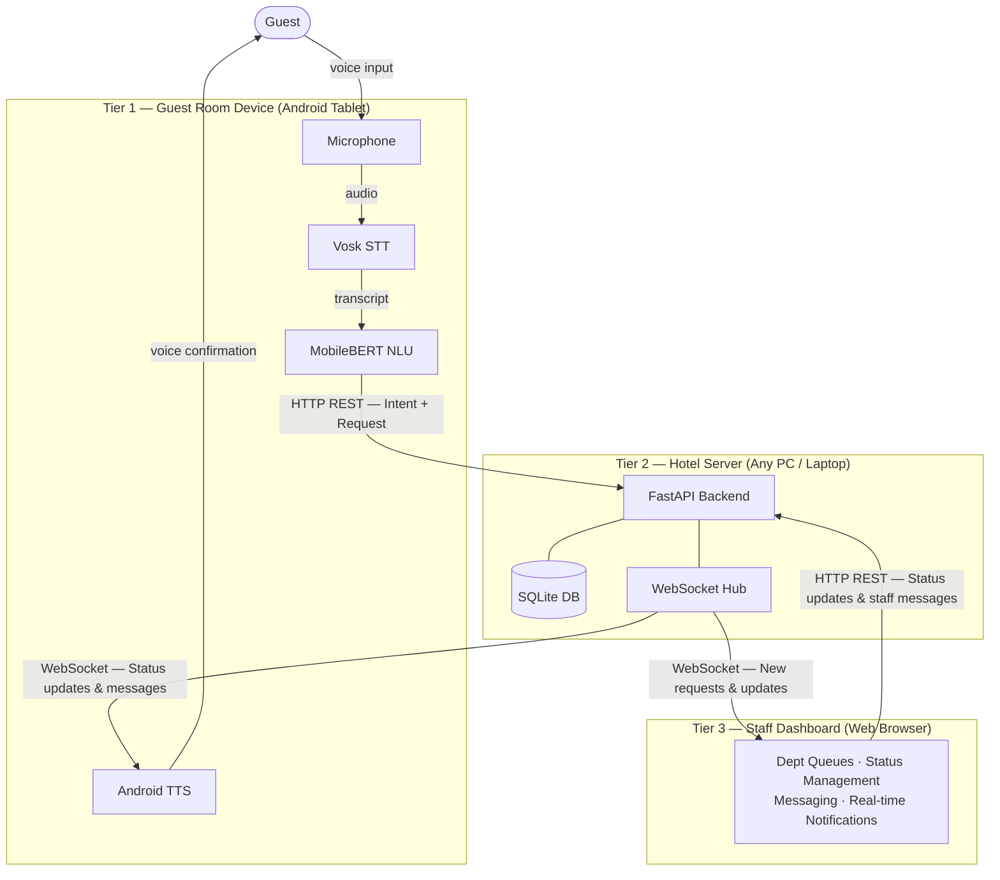

# CHAPTER 3: METHODOLOGY

## 3.1 Introduction

This chapter explains how the system was designed, built, and evaluated. It covers the research approach, development process, architecture, technology choices, dataset preparation, model training, and evaluation strategy. Every major decision connects back to the core constraint: building an affordable, offline voice assistant that actually works on budget hardware in a Sri Lankan hotel.

---

## 3.2 Research Approach

This project follows **Design Science Research (DSR)**, as described by Hevner et al. (2004). DSR is about building and evaluating IT artefacts that solve real, practical problems. It was the right fit here for three reasons:

1. **The research needs a working system.** You cannot measure whether an offline voice assistant performs well on budget hardware without actually building one. Surveys or case studies cannot produce that kind of evidence.

2. **The research gap is practical.** As identified in Chapter 2, no existing system has combined offline on-device NLU — using open-source edge STT and compressed mobile transformers — specifically for hospitality. Closing that gap means building a real implementation, not a theoretical proposal.

3. **Evaluation is part of the process.** DSR requires the artefact to be tested against defined criteria. The evaluation here covers four dimensions that together answer the core research question: NLU accuracy under real pipeline conditions, speech recognition Word Error Rate (WER), system latency, and deployment cost.

The DSR process for this project followed five phases:

1. **Problem Identification** — Identifying operational and technical gaps through the literature review (Chapter 2).
2. **Solution Design** — Defining system requirements, architecture, and the experimental design for comparing NLU training strategies (Chapters 3–6).
3. **Artefact Development** — Building the Android application, backend server, staff dashboard, and three NLU model variants (Chapter 7).
4. **Evaluation** — Measuring NLU accuracy across training conditions, speech recognition WER, and deployment cost (Chapter 8).
5. **Communication** — Reporting findings, limitations, and contributions (Chapters 10 and 11).

---

## 3.3 Development Approach

The system was built using **iterative prototyping** rather than a sequential process. This was not just a preference — it was necessary given how much was unknown before any code was written.

The system combines on-device speech recognition, neural intent classification, and real-time local network communication. None of these could be fully designed upfront because their real-world behaviour on budget hardware was unknown:

- Speech recognition accuracy could only be measured by running Vosk on an actual Android device. No design document could predict how well it would handle Sri Lankan English in a hotel room.
- Intent classification performance depended heavily on how the model dealt with imperfect speech-to-text output — something that only became visible after running the full pipeline end-to-end.
- End-to-end latency could only be measured with all components integrated and running together.

A sequential approach would have delayed these discoveries until it was too late to act on them. The first prototype alone revealed that the larger Vosk model caused load times exceeding 15 seconds on a budget tablet — a finding that directly shaped the final model selection.

The system was built across four iterations:

| Iteration | Focus | Key Output | Key Decision Made |
|-----------|-------|------------|-------------------|
| 1 | On-device speech recognition | Vosk integrated into Android app with live transcription | `vosk-model-small-en-in-0.4` selected; Indian English acoustic model matches Sri Lankan accents better than US English variants |
| 2 | Intent classification pipeline | MobileBERT fine-tuned, converted to TFLite, deployed on-device | Hybrid classification adopted after the purely neural approach struggled on simple keyword-heavy requests |
| 3 | Backend and real-time communication | FastAPI server, SQLite database, WebSocket integration | WebSocket confirmed as viable for real-time guest-to-staff updates over a local network |
| 4 | System integration and evaluation | End-to-end system with staff dashboard and benchmarking | Full pipeline tested; NLU accuracy compared across three training conditions |

Each iteration ended with a review against the research objectives, and what was learned fed into the next phase.

---

## 3.4 System Architecture

The system is built on a **three-tier architecture**: (1) a guest-facing Android application that handles all on-device speech and language processing, (2) a central hotel server that manages request routing and storage, and (3) a web-based staff dashboard for day-to-day operations. All three tiers run entirely within the hotel's local area network (LAN) — no data leaves the building.

**Figure 3.1: High-Level System Architecture**



Running both STT and NLU directly on the guest device was a deliberate design choice for three reasons: (1) **privacy** — raw audio never leaves the device; (2) **reduced server load** — the server only ever receives structured text requests; and (3) **resilience** — the device can still transcribe and classify even if the server is temporarily unreachable. The detailed system design is covered in Chapter 6.

---

## 3.5 Technology Selection

The technology choices for each component — speech recognition, intent classification, backend framework, database, mobile platform, and text-to-speech — are evaluated and justified in Chapter 5 (Section 5.6), against the five core project constraints: offline capability, privacy, low latency, low-cost hardware, and minimal IT infrastructure.

---

## 3.6 Dataset Preparation

### 3.6.1 Intent Category Design

The dataset covers 18 intent categories derived from Sri Lankan hotel room service menus, the hospitality use cases in Buhalis and Moldavska (2021, 2022), and the service categories supported by Alexa for Hospitality. The full category list is defined in Chapter 4 (Table 4.1a) as part of functional requirement FR-03.

### 3.6.2 Dataset Construction

The clean dataset (`new_hotel_dataset.csv`) contains **10,080 labelled utterances** — exactly **560 examples per intent** across all 18 categories, giving a perfectly balanced distribution. The average sentence length is 7.16 words. All text was normalised to lowercase to match Vosk's output format.

The dataset was generated using the Claude Haiku API to produce natural language variations, then expanded with paraphrasing to cover formal, casual, indirect, and abbreviated phrasing styles. All utterances were written in Vosk output style — lowercase, no punctuation, contractions written without apostrophes.

### 3.6.3 Vosk Transcription Pairing — The Core Experimental Dataset

This step is the most important part of the data preparation process. Each of the 10,080 clean utterances was converted to audio using Google Text-to-Speech (TTS) (`gTTS` with `tld='co.in'` for Indian English pronunciation), converted to 16 kHz mono WAV using ffmpeg, and then transcribed by Vosk (`vosk-model-small-en-in-0.4`). The result is a paired dataset (`vosk_transcriptions.csv`) where every utterance has both a clean version and a Vosk-transcribed version side by side.

This pairing deliberately introduces the same STT noise a real guest voice would produce when passed through the on-device Vosk engine. Without it, there would be no way to isolate the accuracy drop caused specifically by the speech recognition step. The WER and Character Error Rate (CER) characteristics of these transcriptions are measured and reported in Chapter 8 (Section 8.3).

### 3.6.4 Three Training Datasets

Three training datasets were derived from the paired data — one for each model variant:

**Table 3.8: Training Datasets**

| Dataset | Records | Contents | Model Trained |
|---------|---------|----------|---------------|
| new_hotel_dataset.csv | 10,080 | Clean text only | Model A (baseline) |
| vosk_only_dataset.csv | 10,080 | Vosk-transcribed text only | Model B |
| paired_dataset.csv | 14,864 | Clean + Vosk mixed (deduplicated) | Model C (proposed approach) |

`paired_dataset.csv` has 14,864 records rather than 20,160 because utterances where Vosk produced output identical to the clean text were removed to avoid redundancy.

### 3.6.5 Train/Validation/Test Split

Each model is trained using a stratified **85%/15% train/validation split** of its respective training dataset. The test set is a held-out **20% of `vosk_transcriptions.csv`** (2,016 samples), shared across all three models to ensure a fair, directly comparable evaluation.

---

## 3.7 Model Training

### 3.7.1 MobileBERT Fine-Tuning

All three model variants are fine-tuned from the same base checkpoint — `google/mobilebert-uncased` from HuggingFace — using an identical training configuration. The only variable across models is the training data. This ensures that any difference in results reflects the impact of training data composition on NLU performance, and nothing else.

**Table 3.9: Training Configuration**

| Hyperparameter | Value | Rationale |
|---------------|-------|-----------|
| Base Model | google/mobilebert-uncased | Smallest BERT variant designed for on-device deployment |
| Task | Multi-class classification (18 intents) | — |
| Epochs | 5 (with early stopping, patience = 2) | Training stops if F1 macro does not improve for 2 consecutive epochs |
| Learning Rate | 3e-5 | Standard for BERT fine-tuning (Devlin et al., 2019) |
| Batch Size | 16 | Suited to CPU training constraints |
| Optimiser | AdamW | Standard for transformer fine-tuning |
| Warmup Ratio | 10% of training steps | Stabilises early training |
| Weight Decay | 0.01 | L2 regularisation |
| Max Gradient Norm | 1.0 | Gradient clipping |
| LR Scheduler | Linear decay | — |
| Max Sequence Length | 32 tokens | Over 98% of hotel requests are under 10 words |
| Best Model Selection | Highest F1 macro on validation set | — |
| Seed | 42 | Reproducibility |

The maximum sequence length of 32 tokens was set after inspecting the training data, where over 98% of utterances contained fewer than 10 words (roughly 15 tokens after tokenisation). Shorter sequences reduce inference time and memory usage during on-device execution.

---

## 3.8 Evaluation Methodology

The evaluation covers four dimensions, each tied directly to a research objective.

### 3.8.1 NLU Accuracy — Three-Model Comparison

This is the central evaluation of the research. The three model variants (A, B, C) are each tested on the same 2,016-sample held-out test set under two input conditions:

- **Clean text**: Evaluates performance without any transcription errors (upper-bound condition).
- **Vosk-transcribed text**: Evaluates performance under real pipeline conditions, where the accuracy gap becomes visible.

Metrics reported for each model and condition:

- **Accuracy**: Overall proportion of correct classifications.
- **Precision, Recall, F1-score**: Per-intent and macro-averaged.
- **Confusion matrix**: To identify systematic misclassification between semantically similar intents.

The key comparison is between Model A and Model C on Vosk output. This shows whether noise-aware training produces NLU accuracy sufficient for real pipeline conditions — one of the core technical dimensions of system viability.

### 3.8.2 Speech Recognition Accuracy

Vosk's transcription quality is measured using **WER** — the standard metric for speech recognition systems, calculated as:

```
WER = (Substitutions + Insertions + Deletions) / Total Reference Words
```

Vosk transcriptions from the pipeline are compared against the original clean text using the `jiwer` Python library. The WER is broken down by intent category to identify which service request types are most affected by transcription errors. This per-intent view is important because it directly explains which NLU categories are most at risk of accuracy degradation in a real deployment.

### 3.8.3 System Latency

End-to-end response time was observed during integration testing — from voice input completion through to the staff dashboard update. Timestamps were logged at each pipeline stage: STT processing, NLU classification (keyword check and/or model inference), HTTP submission, WebSocket delivery, and TTS playback confirmation. Formal statistical measurement across a large number of test requests was not completed within the scope of this project; latency is reported as observed during functional testing and identified as a direction for future work.

### 3.8.4 Cost-Effectiveness

- **Metric**: Per-room deployment cost (hardware + software + ongoing fees).
- **Method**: Itemised cost comparison across two scenarios:
  1. This system (commodity Android tablet, local production-grade server, no recurring fees).
  2. Cloud-based and commercial alternatives (Google Cloud STT, Alexa for Hospitality).
- **Projection period**: 3 years for a hypothetical 50-room hotel.

---

## 3.9 Summary

This chapter has described the research methodology, dataset preparation, model training, and evaluation strategy for the proposed voice assistant system. Technology selection is covered in Chapter 5 (Section 5.6), and the detailed system design is in Chapter 6.

Design Science Research was chosen because the project needed both a working system and a systematic evaluation of it. Iterative prototyping was used because the key technical unknowns — particularly how multiple AI components would behave together on budget hardware — could only be resolved by building and running real prototypes.

The most important part of the data preparation was creating the paired clean-and-Vosk-transcribed dataset: 10,080 utterances passed through a TTS-to-Vosk pipeline to simulate real pipeline conditions. This enables the three-model comparison (clean-trained, Vosk-trained, and mixed-trained) that evaluates the NLU component's accuracy under the conditions it would face in a real hotel deployment — directly informing whether the system is viable.

Key decisions — including `vosk-model-small-en-in-0.4` for Indian English acoustic matching, the two-tier hybrid NLU pipeline, and WebSocket-based real-time communication over LAN — are all grounded in the research objectives and the real deployment constraints of budget Sri Lankan hotels. The next chapter documents the requirements elicitation process and the full functional and non-functional requirements that shaped these decisions.
