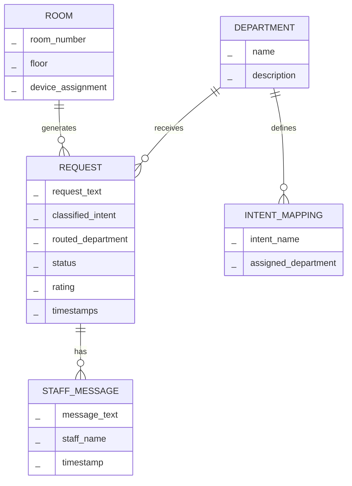

```mermaid
erDiagram
    ROOM ||--o{ REQUEST : "generates"
    DEPARTMENT ||--o{ REQUEST : "receives"
    DEPARTMENT ||--o{ INTENT_MAPPING : "defines"
    REQUEST ||--o{ STAFF_MESSAGE : "has"

    ROOM {
        _ room_number
        _ floor
        _ device_assignment
    }

    DEPARTMENT {
        _ name
        _ description
    }

    INTENT_MAPPING {
        _ intent_name
        _ assigned_department
    }

    REQUEST {
        _ request_text
        _ classified_intent
        _ routed_department
        _ status
        _ rating
        _ timestamps
    }

    STAFF_MESSAGE {
        _ message_text
        _ staff_name
        _ timestamp
    }
```