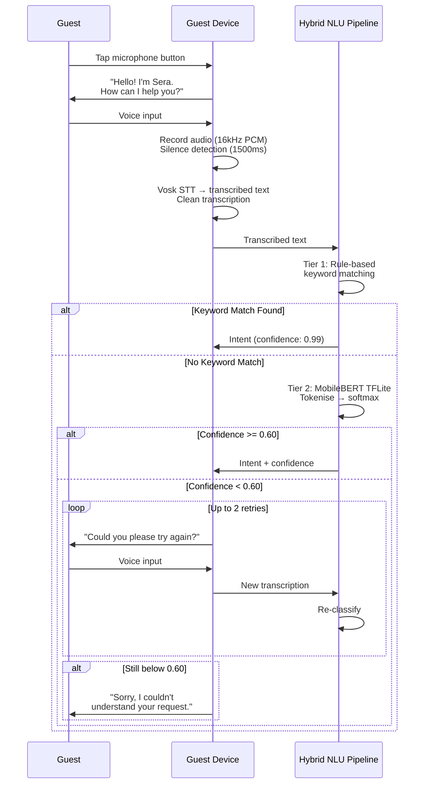

```mermaid
sequenceDiagram
    participant G as Guest
    participant APP as Guest Device
    participant NLU as Hybrid NLU Pipeline

    G->>APP: Tap microphone button
    APP->>G: "Hello! I'm Sera.<br/>How can I help you?"

    G->>APP: Voice input
    APP->>APP: Record audio (16kHz PCM)<br/>Silence detection (1500ms)
    APP->>APP: Vosk STT → transcribed text<br/>Clean transcription

    APP->>NLU: Transcribed text

    NLU->>NLU: Tier 1: Rule-based<br/>keyword matching

    alt Keyword Match Found
        NLU->>APP: Intent (confidence: 0.99)
    else No Keyword Match
        NLU->>NLU: Tier 2: MobileBERT TFLite<br/>Tokenise → softmax

        alt Confidence >= 0.60
            NLU->>APP: Intent + confidence
        else Confidence < 0.60
            loop Up to 2 retries
                APP->>G: "Could you please try again?"
                G->>APP: Voice input
                APP->>NLU: New transcription
                NLU->>NLU: Re-classify
            end
            alt Still below 0.60
                APP->>G: "Sorry, I couldn't<br/>understand your request."
            end
        end
    end
```