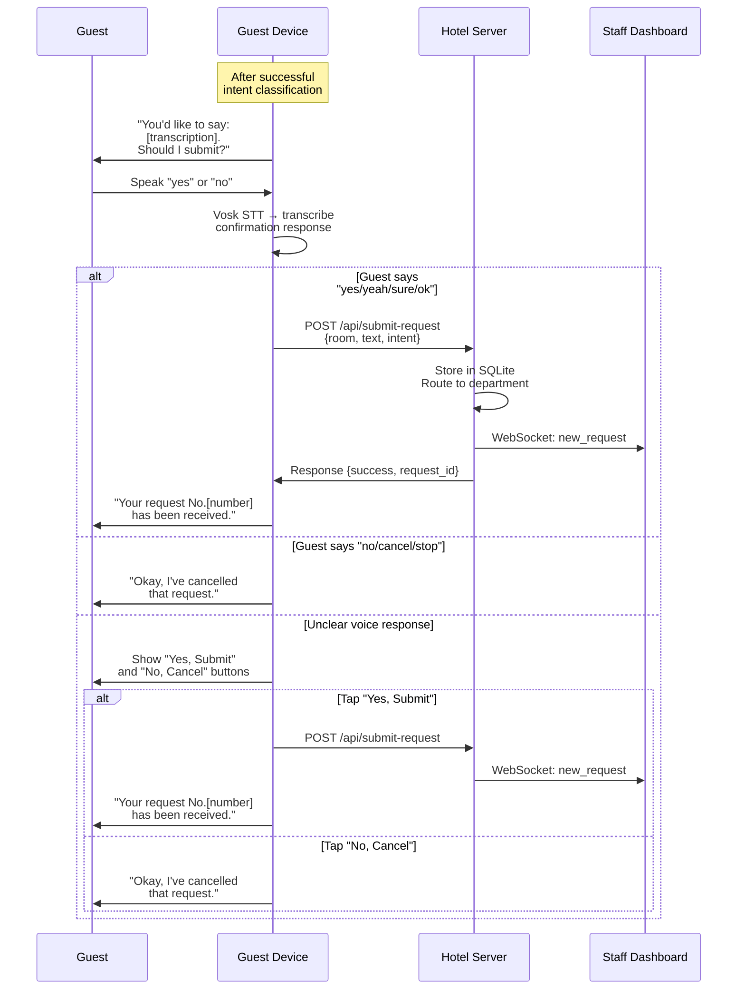

```mermaid
sequenceDiagram
    participant G as Guest
    participant APP as Guest Device
    participant SRV as Hotel Server
    participant SD as Staff Dashboard

    Note over APP: After successful<br/>intent classification

    APP->>G: "You'd like to say:<br/>[transcription].<br/>Should I submit?"

    G->>APP: Speak "yes" or "no"
    APP->>APP: Vosk STT → transcribe<br/>confirmation response

    alt Guest says "yes/yeah/sure/ok"
        APP->>SRV: POST /api/submit-request<br/>{room, text, intent}
        SRV->>SRV: Store in SQLite<br/>Route to department
        SRV->>SD: WebSocket: new_request
        SRV->>APP: Response {success, request_id}
        APP->>G: "Your request No.[number]<br/>has been received."

    else Guest says "no/cancel/stop"
        APP->>G: "Okay, I've cancelled<br/>that request."

    else Unclear voice response
        APP->>G: Show "Yes, Submit"<br/>and "No, Cancel" buttons
        alt Tap "Yes, Submit"
            APP->>SRV: POST /api/submit-request
            SRV->>SD: WebSocket: new_request
            APP->>G: "Your request No.[number]<br/>has been received."
        else Tap "No, Cancel"
            APP->>G: "Okay, I've cancelled<br/>that request."
        end
    end
```