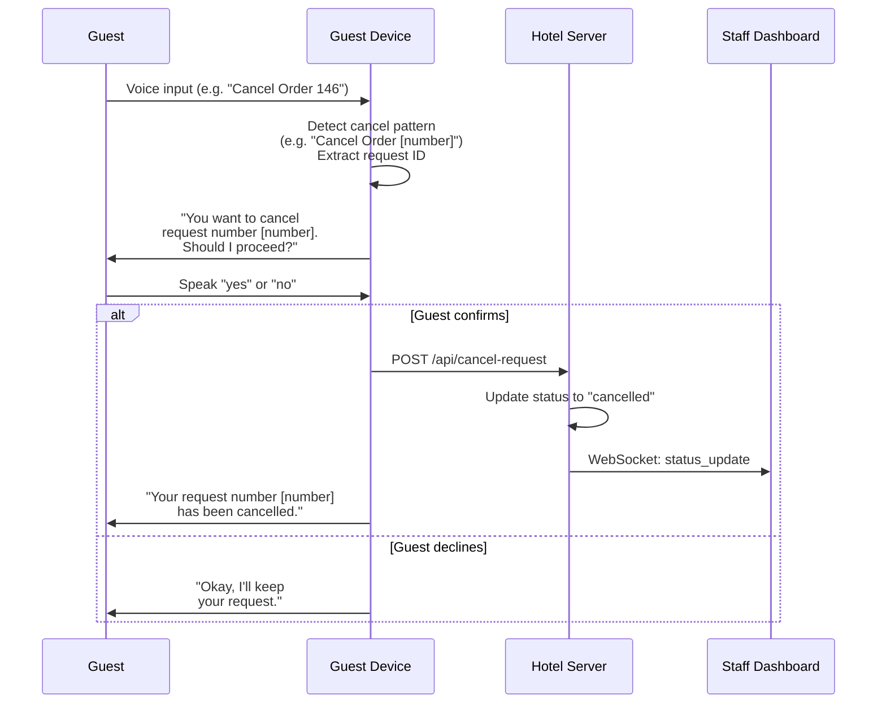

```mermaid
sequenceDiagram
    participant G as Guest
    participant APP as Guest Device
    participant SRV as Hotel Server
    participant SD as Staff Dashboard

    G->>APP: Voice input (e.g. "Cancel Order 146")

    APP->>APP: Detect cancel pattern<br/>(e.g. "Cancel Order [number]")<br/>Extract request ID

    APP->>G: "You want to cancel<br/>request number [number].<br/>Should I proceed?"

    G->>APP: Speak "yes" or "no"

    alt Guest confirms
        APP->>SRV: POST /api/cancel-request
        SRV->>SRV: Update status to "cancelled"
        SRV->>SD: WebSocket: status_update
        APP->>G: "Your request number [number]<br/>has been cancelled."

    else Guest declines
        APP->>G: "Okay, I'll keep<br/>your request."
    end
```