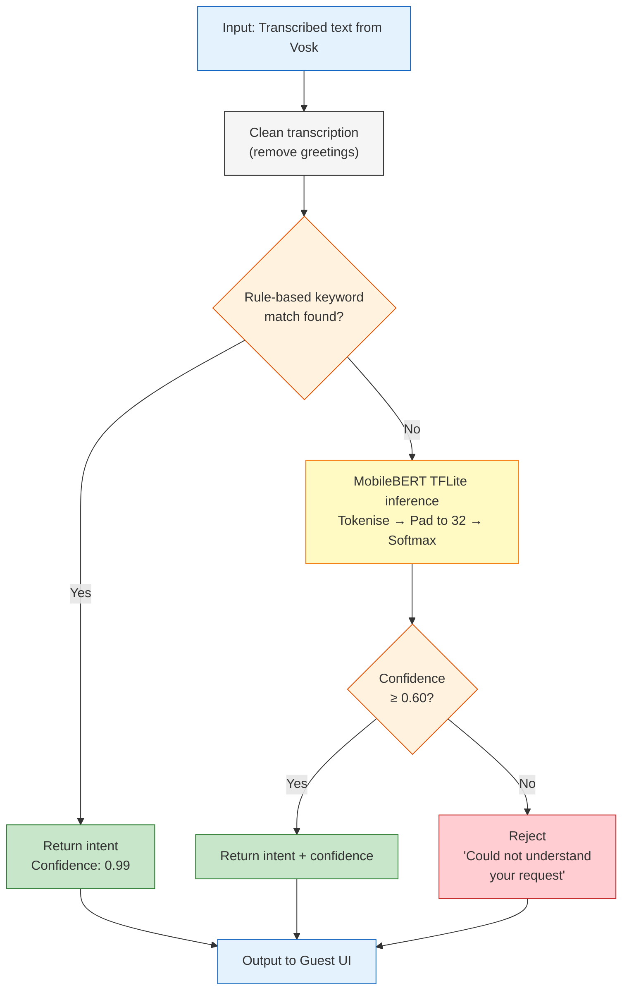

```mermaid
flowchart TD
    INPUT["Input: Transcribed text from Vosk"]
    CLEAN["Clean transcription<br/>(remove greetings)"]
    RULE{"Rule-based keyword<br/>match found?"}
    RULE_YES["Return intent<br/>Confidence: 0.99"]
    MBERT["MobileBERT TFLite inference<br/>Tokenise → Pad to 32 → Softmax"]
    CONF{"Confidence<br/>≥ 0.60?"}
    CONF_YES["Return intent + confidence"]
    CONF_NO["Reject<br/>'Could not understand<br/>your request'"]
    OUTPUT["Output to Guest UI"]

    INPUT --> CLEAN
    CLEAN --> RULE
    RULE -->|Yes| RULE_YES
    RULE -->|No| MBERT
    RULE_YES --> OUTPUT
    MBERT --> CONF
    CONF -->|Yes| CONF_YES
    CONF -->|No| CONF_NO
    CONF_YES --> OUTPUT
    CONF_NO --> OUTPUT

    style INPUT fill:#e3f2fd,stroke:#1565c0
    style CLEAN fill:#f5f5f5,stroke:#333
    style RULE fill:#fff3e0,stroke:#e65100
    style RULE_YES fill:#c8e6c9,stroke:#2e7d32
    style MBERT fill:#fff9c4,stroke:#f57f17
    style CONF fill:#fff3e0,stroke:#e65100
    style CONF_YES fill:#c8e6c9,stroke:#2e7d32
    style CONF_NO fill:#ffcdd2,stroke:#c62828
    style OUTPUT fill:#e3f2fd,stroke:#1565c0
```