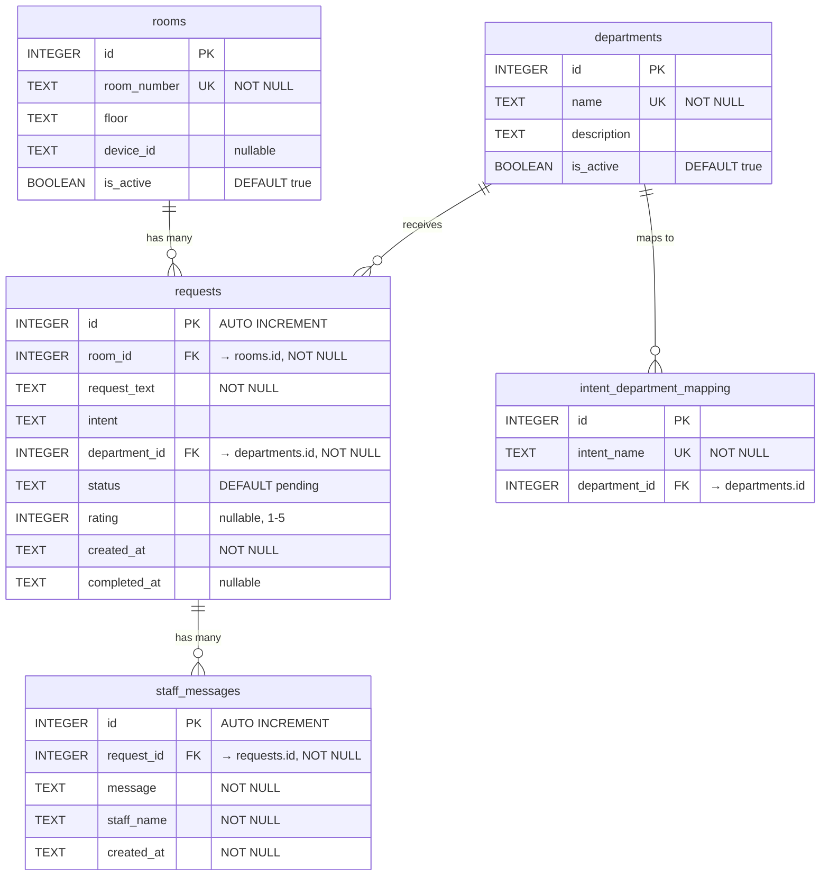

```mermaid
erDiagram
    rooms {
        INTEGER id PK
        TEXT room_number UK "NOT NULL"
        TEXT floor
        TEXT device_id "nullable"
        BOOLEAN is_active "DEFAULT true"
    }

    departments {
        INTEGER id PK
        TEXT name UK "NOT NULL"
        TEXT description
        BOOLEAN is_active "DEFAULT true"
    }

    intent_department_mapping {
        INTEGER id PK
        TEXT intent_name UK "NOT NULL"
        INTEGER department_id FK "→ departments.id"
    }

    requests {
        INTEGER id PK "AUTO INCREMENT"
        INTEGER room_id FK "→ rooms.id, NOT NULL"
        TEXT request_text "NOT NULL"
        TEXT intent
        INTEGER department_id FK "→ departments.id, NOT NULL"
        TEXT status "DEFAULT pending"
        INTEGER rating "nullable, 1-5"
        TEXT created_at "NOT NULL"
        TEXT completed_at "nullable"
    }

    staff_messages {
        INTEGER id PK "AUTO INCREMENT"
        INTEGER request_id FK "→ requests.id, NOT NULL"
        TEXT message "NOT NULL"
        TEXT staff_name "NOT NULL"
        TEXT created_at "NOT NULL"
    }

    rooms ||--o{ requests : "has many"
    departments ||--o{ requests : "receives"
    departments ||--o{ intent_department_mapping : "maps to"
    requests ||--o{ staff_messages : "has many"

```