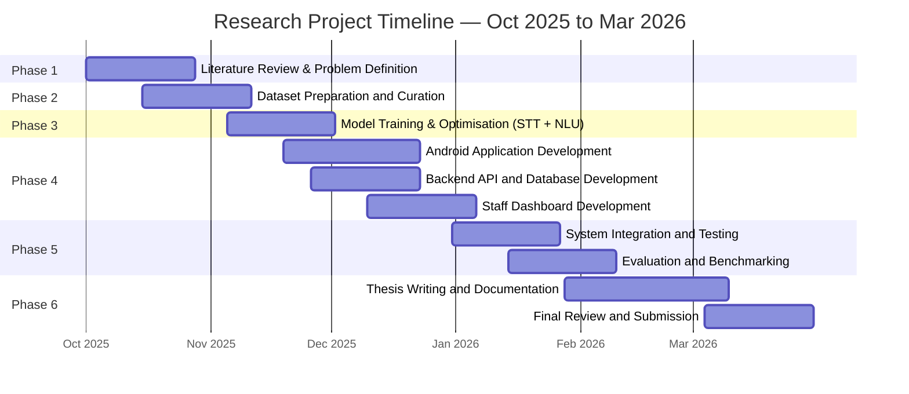

```mermaid
gantt
    title Research Project Timeline — Oct 2025 to Mar 2026
    dateFormat  YYYY-MM-DD
    axisFormat  %b %Y

    section Phase 1
    Literature Review & Problem Definition     :p1, 2025-10-01, 2025-10-28

    section Phase 2
    Dataset Preparation and Curation           :p2, 2025-10-15, 2025-11-11

    section Phase 3
    Model Training & Optimisation (STT + NLU)  :p3, 2025-11-05, 2025-12-02

    section Phase 4
    Android Application Development            :p4a, 2025-11-19, 2025-12-23
    Backend API and Database Development       :p4b, 2025-11-26, 2025-12-23
    Staff Dashboard Development                :p4c, 2025-12-10, 2026-01-06

    section Phase 5
    System Integration and Testing             :p5a, 2025-12-31, 2026-01-27
    Evaluation and Benchmarking                :p5b, 2026-01-14, 2026-02-10

    section Phase 6
    Thesis Writing and Documentation           :p6a, 2026-01-28, 2026-03-10
    Final Review and Submission                :p6b, 2026-03-04, 2026-03-31
```
